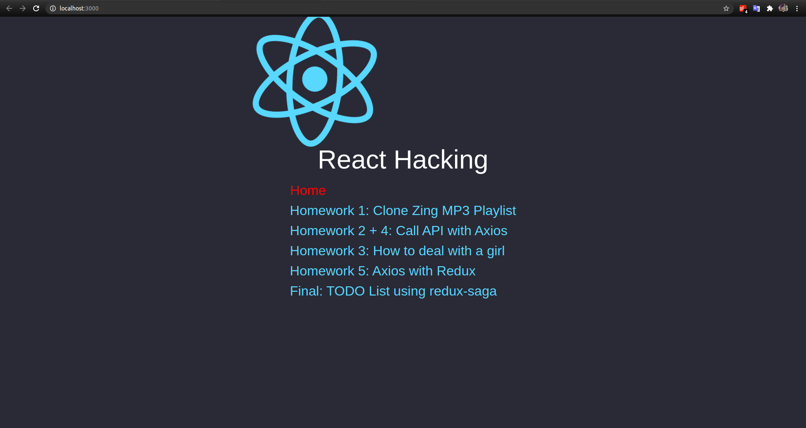
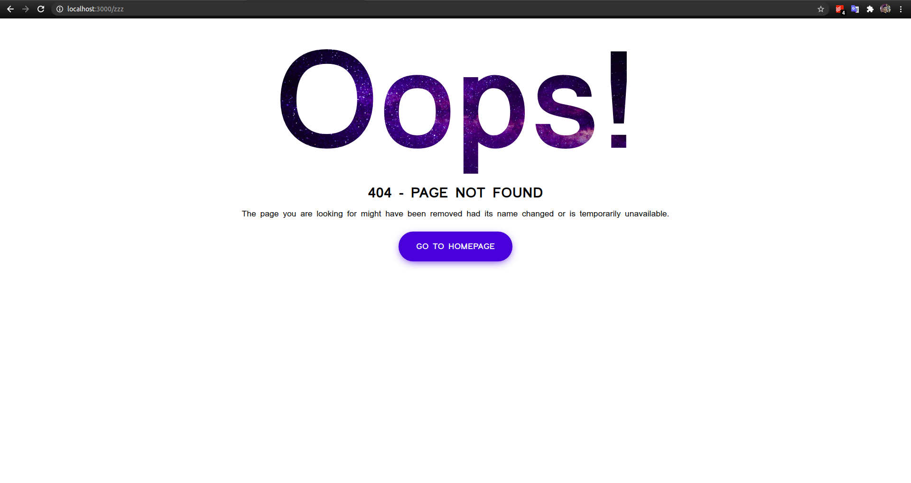
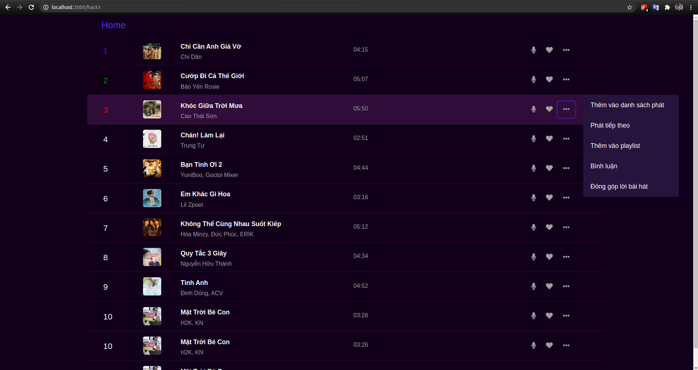
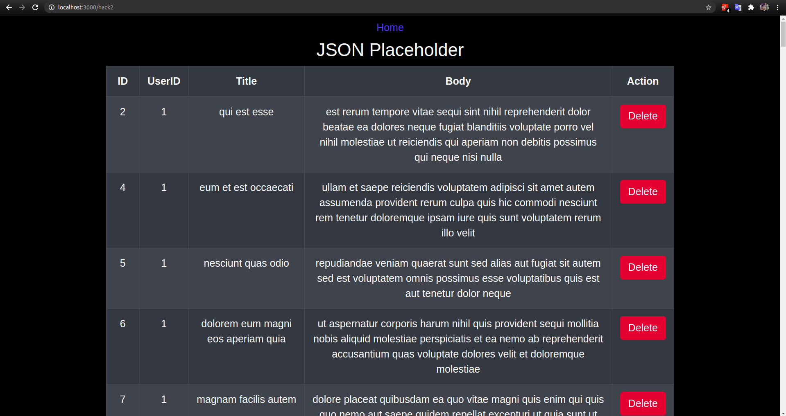
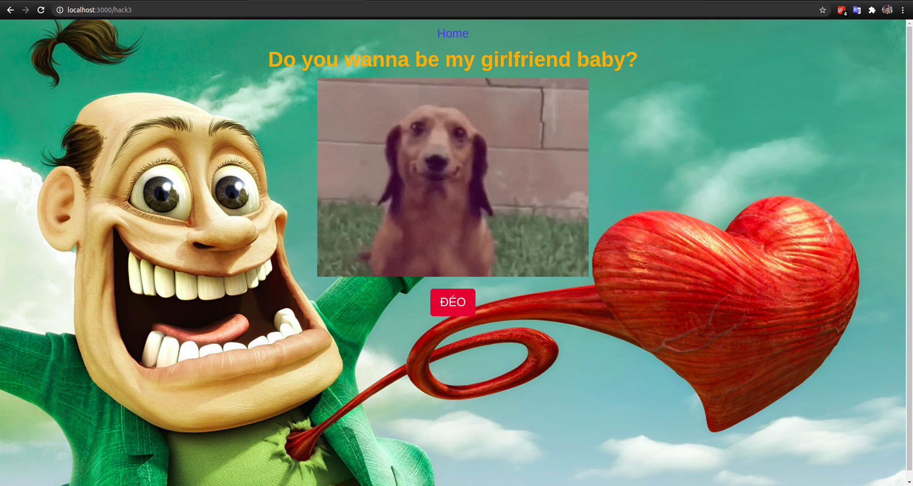
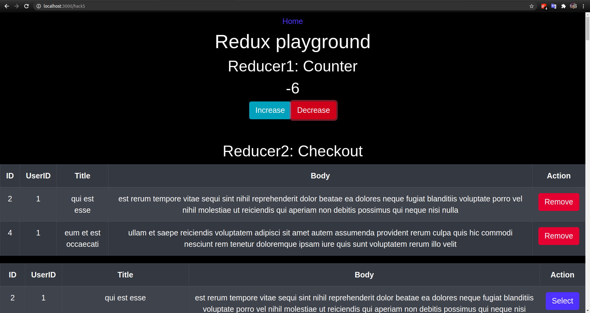
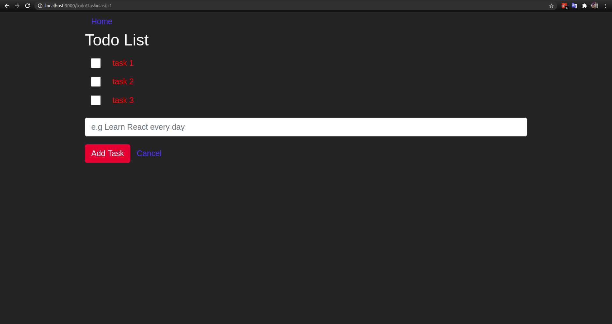

# React Hacking
Personal reactjs learning project

### Homepage

### 404 NotFound page

### Homework 1: Clone Zing MP3 Playlist using `props-state`
The songs are received from a json file

### Homework 2 + 4: Calling APIs with `axios`
Getting data from local `json-server` api, including: GET (all/by ID), DELETE

### Homework 3: Playing with `Event Handling`, static files

### Homework 5: Playing with `react-redux`
Practicing with global state, using multiple reducers with `combineReducers`

### Final: Creating a simple check list (todo list) using `redux-saga`
Dispatching actions to saga, then calling APIs, returning data to reducers
